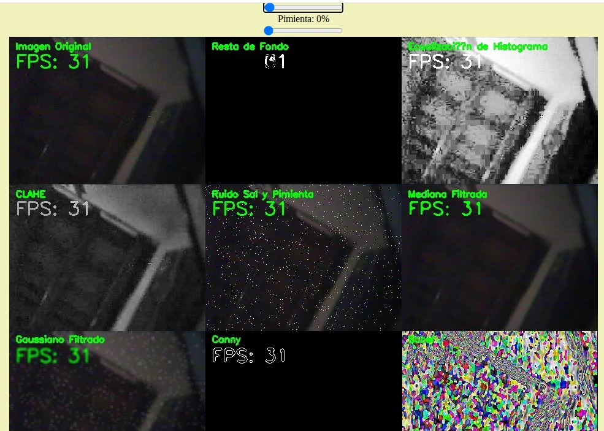

# Detección de movimiento a través de resta de imágenes, convolución, aplicación de filtros para reducción de ruido y operaciones morfológicas en la mejora de imágenes médicas.

**Estudiantes:**

Jeison Pañora \
Paúl Sigua

# PARTE 1

## 1. Filtros aplicados en la Parte 1 de la práctica

1. Histograma

La ecualización de histograma es una técnica que mejora el contraste de una imagen. Su objetivo es redistribuir los niveles de intensidad de una imagen para que el histograma de los valores de intensidad sea lo más uniforme posible. 

Proceso:

Primero, el Histograma de una imagen es una función H(i) que cuenta el número de píxeles ni en cada nivel de intensidad i en una escala de 0 a 255 (imagen de 8 bits)

Segundo, se utilza la Función de Distribución Acumulativa (CDF) para convertir la imagen original.

Tercero, se aplica la transformación por cada pixel tomando la intensidad utilizando CDF normalizada, para que los valores de los pixeles se distribuyan a lo largo del rango de intensidades.

```py
def apply_histogram_equalization(frame):
    gray = cv2.cvtColor(frame, cv2.COLOR_BGR2GRAY)
    equalized = cv2.equalizeHist(gray)
    return equalized
```

2. CLAHE

CLAHE significa Contraste Limitado Adaptativo de Ecualización de Histograma, es una variación de la ecualización de histograma que mejora el contraste en pequeñas áreas de la imagen en lugar de hacerlo en toda la imagen compleata

Proceso:

Primero, divide la imagen en bloque o "tiles", luego se calcula el histograma y se aplica la ecualización de histograma.

Segundo, se limita el contraste para evitar la amplificación excesiva del ruido en regiones homogéneas para cada bloque. Esto se logra fijando un valor máximo para el histograma de cada tile, llamado `clipLimit`. Si el valor de intensidad de un bin supera el límite, se redistribuye el exceso en otros niveles del histograma.

Tercero, se interponlan entre bloques para evitar discontinuidades en las fronteras de los bloques, generando una imagen continua.

```py
def apply_CLAHE(frame):
    gray = cv2.cvtColor(frame, cv2.COLOR_BGR2GRAY)
    clahe = cv2.createCLAHE(clipLimit=2.0, tileGridSize=(8, 8))
    clahe_applied = clahe.apply(gray)
    return clahe_applied
```

3. Resta de Datos con KNN

La resta de fondo con KNN es una técnica de segmentación que clasifica píxeles en primer plano o fondo utilizando el método de los k-vecinos más cercanos.

Proceso:

Primero, se aplica un modelo de fondo, cada píxel mantiene un historial de valores de intensidad. Este historial es una ventana deslizante que almacena los últimos `N` de intensidad en un periodo de tiempo.

Segundo, se clasifican los píxeles comparando el valor de este con los k valores más cercanos según el historial. Si el valor actual tiene una distancia baja, es decir, es parecida a la mayoría de valores en el historial, se clasifica como fondo o sino como primer plano.

Tercero, se actualiza el historial. Al momento en el que se clasifica un píxel, su valor se agrega al historial, manteniendo así el modelo del fonco actualizado.

```py
def background_subtraction_knn(frame):
    fg_mask = background_subtractor_knn.apply(frame)
    return fg_mask
```

## 3. Reflexión

Cada filtro y técnica tiene sus propias ventajas y limitaciones. En general, CLAHE y el filtro de mediana mostraron mejores resultados en términos de preservación de detalles y reducción de ruido, siendo útiles en imágenes donde la claridad y el contraste local son importantes.



Como se puede apreciar en la anterior imagen, los filtros aplicados según los respectivos resultados, permiten apreciar que los filtros con mayor resolución fueron CLAHE y el fltro de la mediana ya que los aspectos de la imagen son claros y permiten apreciar mejor los detalles.

# PARTE 2

## 1. Refelexión

La aplicación de operaciones morfológicas en las imágenes como la erosión, dilatación, top hat y black hat nos ayuda a tener imágenes con características más claras, en donde se puede apreciar cómo afecta las distintas dimensiones de las máscaras ya que probamos con máscaras de 30x30, 37x37 y 40x40 en donde lo recomendado por estudios es una máscara de 37x37.

Con la máscara de 30x30, se obtuvieron bordes más definidos y áreas internas menos detalladas, logrando una nitidez favorable que mejoró la visibilidad general de las estructuras principales. 


Al emplear la máscara de 37x37, se observó una mejora significativa en la captura de las estructuras principales, manteniendo un equilibrio óptimo entre nitidez y detalle.


Finalmente, al utilizar la máscara de 40x40, se logró una mayor nitidez en las áreas principales, pero se perdió información en detalles pequeños, ya que la máscara grande tiende a eliminar variaciones pequeñas y a resaltar únicamente las estructuras principales. Por lo que es necesario elegir el tamaño de máscara adecuado para obtener imágenes nítidas y con el nivel de detalle requerido para cada análisis.


